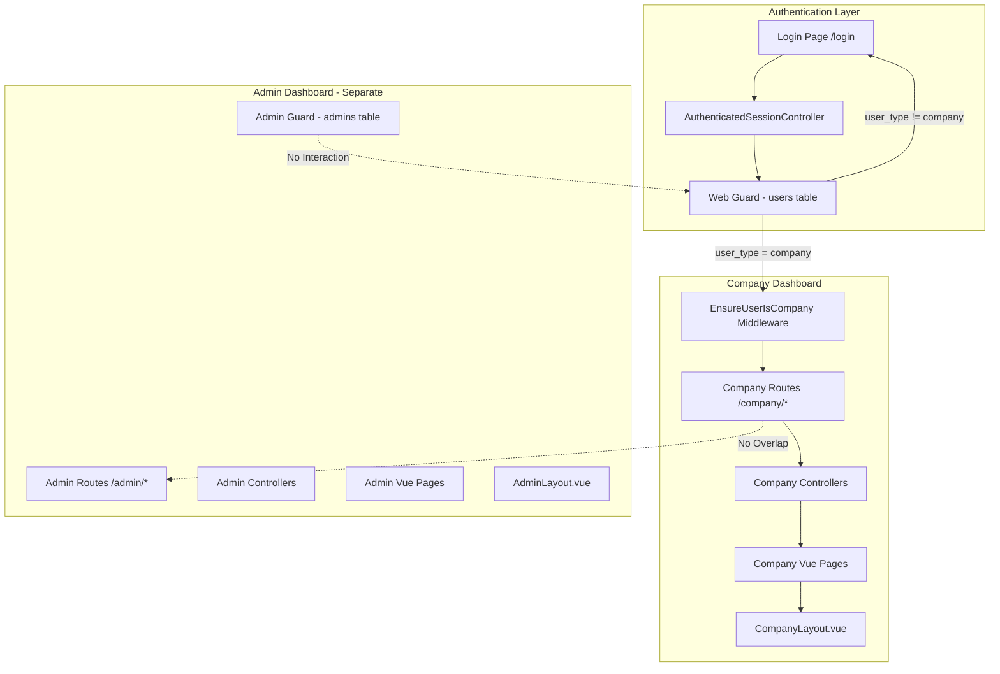
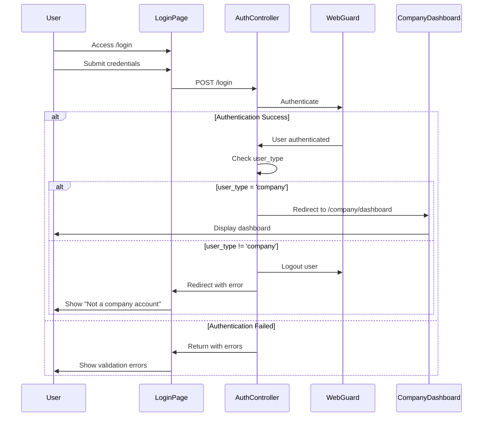

# Design Document: Company Dashboard

## Overview

### Purpose

تصميم لوحة تحكم مستقلة للشركات (Company Dashboard) في نظام Laravel 12 + Inertia.js + Vue 3، منفصلة تمامًا عن لوحة تحكم المشرفين (Admin Dashboard) مع ضمان عدم وجود أي تعارض في المصادقة، المسارات، أو الواجهات.

### Key Design Principles

1. **Separation of Concerns**: فصل كامل بين نظام الشركات ونظام المشرفين
2. **Security First**: التحقق من نوع المستخدم في كل طبقة (Authentication, Middleware, Authorization)
3. **Code Reusability**: استخدام نفس الأنماط والمكونات المشتركة حيثما أمكن
4. **Maintainability**: بنية واضحة ومنظمة تسهل الصيانة والتطوير المستقبلي

### Technology Stack

- **Backend**: Laravel 12
- **Frontend**: Vue 3 + Inertia.js
- **Styling**: Tailwind CSS
- **Internationalization**: vue-i18n
- **Authentication**: Laravel Breeze (Web Guard)
- **Authorization**: Laravel Policies

## Architecture

### High-Level Architecture



### Authentication Flow



### Middleware Stack

```
Request Flow for Company Routes:
┌─────────────────────────────────────┐
│ 1. web middleware                   │
│    - Session handling               │
│    - CSRF protection                │
│    - Cookie encryption              │
└─────────────────────────────────────┘
           ↓
┌─────────────────────────────────────┐
│ 2. auth:web middleware              │
│    - Check authentication           │
│    - Redirect to /login if guest    │
└─────────────────────────────────────┘
           ↓
┌─────────────────────────────────────┐
│ 3. company middleware               │
│    - Verify user_type = 'company'   │
│    - Abort 403 if not company       │
└─────────────────────────────────────┘
           ↓
┌─────────────────────────────────────┐
│ Company Controller                  │
└─────────────────────────────────────┘
```

## Components and Interfaces

### Backend Components

#### 1. Middleware: EnsureUserIsCompany

**Location**: `app/Http/Middleware/EnsureUserIsCompany.php`

**Purpose**: التحقق من أن المستخدم المصادق عليه هو من نوع 'company'

**Interface**:
```php
class EnsureUserIsCompany
{
    public function handle(Request $request, Closure $next): Response
    {
        // Get authenticated user from web guard
        $user = Auth::guard('web')->user();
        
        // If no user, redirect to login
        if (!$user) {
            return redirect()->route('login');
        }
        
        // Check if user_type is 'company'
        if ($user->user_type !== 'company') {
            abort(403, 'Access denied. This area is for companies only.');
        }
        
        return $next($request);
    }
}
```

**Registration**: في `bootstrap/app.php`:
```php
->withMiddleware(function (Middleware $middleware) {
    $middleware->alias([
        'company' => \App\Http\Middleware\EnsureUserIsCompany::class,
    ]);
})
```

#### 2. Modified AuthenticatedSessionController

**Location**: `app/Http/Controllers/Auth/AuthenticatedSessionController.php`

**Modification**: تعديل method `store` للتحقق من نوع المستخدم بعد المصادقة

**Modified Logic**:
```php
public function store(LoginRequest $request): RedirectResponse
{
    $request->authenticate();
    $request->session()->regenerate();
    
    $user = Auth::guard('web')->user();
    
    // Check user type and redirect accordingly
    if ($user->user_type === 'company') {
        return redirect()->intended(route('company.dashboard'));
    }
    
    // If not a company user, logout and redirect back with error
    Auth::guard('web')->logout();
    $request->session()->invalidate();
    $request->session()->regenerateToken();
    
    return redirect()->route('login')
        ->withErrors(['email' => 'This account is not a company account.']);
}
```

#### 3. Company Controllers

**Base Structure**:
```
app/Http/Controllers/Company/
├── DashboardController.php
├── ProfileController.php
├── ProductController.php
├── MessageController.php
└── OfferController.php
```

**Base Controller Pattern**:
```php
namespace App\Http\Controllers\Company;

use App\Http\Controllers\Controller;
use Illuminate\Support\Facades\Auth;
use Inertia\Inertia;

class BaseCompanyController extends Controller
{
    protected function getCompanyUser()
    {
        return Auth::guard('web')->user();
    }
    
    protected function getCompanyProfile()
    {
        return Auth::guard('web')->user()->companyProfile;
    }
}
```

**DashboardController**:
```php
class DashboardController extends BaseCompanyController
{
    public function index()
    {
        $user = $this->getCompanyUser();
        $profile = $this->getCompanyProfile();
        
        $stats = [
            'total_products' => $user->products()->count(),
            'total_messages' => $user->conversations()->count(),
            'active_offers' => $user->offers()->where('is_active', true)->count(),
        ];
        
        return Inertia::render('Company/Dashboard', [
            'stats' => $stats,
            'profile' => $profile,
        ]);
    }
}
```

**ProfileController**:
```php
class ProfileController extends BaseCompanyController
{
    public function show()
    {
        return Inertia::render('Company/Profile', [
            'user' => $this->getCompanyUser()->load('companyProfile.category'),
        ]);
    }
    
    public function update(ProfileUpdateRequest $request)
    {
        $user = $this->getCompanyUser();
        
        DB::transaction(function () use ($user, $request) {
            // Update User model
            $user->update($request->only([
                'first_name', 'last_name', 'email', 
                'phone_number', 'whatsapp_number',
                'facebook', 'x_url', 'linkedin', 'instagram'
            ]));
            
            // Update CompanyProfile
            $user->companyProfile->update($request->only([
                'company_name', 'category_id'
            ]));
            
            // Handle logo upload if present
            if ($request->hasFile('logo')) {
                $path = $request->file('logo')->store('company-logos', 'public');
                $user->companyProfile->update(['logo_path' => $path]);
            }
        });
        
        return redirect()->route('company.profile')
            ->with('success', 'Profile updated successfully');
    }
}
```

**ProductController**:
```php
class ProductController extends BaseCompanyController
{
    public function index()
    {
        $products = $this->getCompanyUser()
            ->products()
            ->with('category', 'tags')
            ->paginate(15);
        
        return Inertia::render('Company/Products/Index', [
            'products' => $products,
        ]);
    }
    
    public function create()
    {
        return Inertia::render('Company/Products/Create', [
            'categories' => Category::active()->get(),
            'tags' => Tag::active()->get(),
        ]);
    }
    
    public function store(ProductStoreRequest $request)
    {
        $product = $this->getCompanyUser()->products()->create(
            $request->validated()
        );
        
        // Attach tags if present
        if ($request->has('tags')) {
            $product->tags()->sync($request->tags);
        }
        
        return redirect()->route('company.products.index')
            ->with('success', 'Product created successfully');
    }
    
    public function edit(Product $product)
    {
        // Authorization check
        $this->authorize('update', $product);
        
        return Inertia::render('Company/Products/Edit', [
            'product' => $product->load('category', 'tags'),
            'categories' => Category::active()->get(),
            'tags' => Tag::active()->get(),
        ]);
    }
    
    public function update(ProductUpdateRequest $request, Product $product)
    {
        $this->authorize('update', $product);
        
        $product->update($request->validated());
        
        if ($request->has('tags')) {
            $product->tags()->sync($request->tags);
        }
        
        return redirect()->route('company.products.index')
            ->with('success', 'Product updated successfully');
    }
    
    public function destroy(Product $product)
    {
        $this->authorize('delete', $product);
        
        $product->delete();
        
        return redirect()->route('company.products.index')
            ->with('success', 'Product deleted successfully');
    }
}
```

#### 4. Authorization Policies

**ProductPolicy**:
```php
namespace App\Policies;

use App\Models\User;
use App\Models\Product;

class ProductPolicy
{
    public function update(User $user, Product $product): bool
    {
        return $user->id === $product->user_id 
            && $user->user_type === 'company';
    }
    
    public function delete(User $user, Product $product): bool
    {
        return $user->id === $product->user_id 
            && $user->user_type === 'company';
    }
}
```

### Frontend Components

#### 1. CompanyLayout.vue

**Location**: `resources/js/components/layout/CompanyLayout.vue`

**Structure**:
```vue
<template>
  <div class="min-h-screen xl:flex">
    <company-sidebar />
    <backdrop />
    <div
      class="flex-1 transition-all duration-300 ease-in-out bg-gray-50 dark:bg-gray-900"
      :class="[
        (isExpanded || isHovered)
          ? 'lg:[padding-inline-start:290px]'
          : 'lg:[padding-inline-start:90px]'
      ]"
    >
      <company-header />
      <div class="p-4 mx-auto max-w-(--breakpoint-2xl) md:p-6">
        <slot></slot>
      </div>
    </div>
    <notification-host position="top-end" />
  </div>
</template>

<script setup>
import CompanySidebar from './CompanySidebar.vue'
import CompanyHeader from './CompanyHeader.vue'
import { useSidebar } from '@/composables/useSidebar'
import Backdrop from './Backdrop.vue'
import NotificationHost from '@/components/notification/NotificationHost.vue'

const { isExpanded, isHovered } = useSidebar()
</script>
```

#### 2. CompanySidebar.vue

**Navigation Items**:
```javascript
const navigationItems = [
  {
    name: 'Dashboard',
    route: 'company.dashboard',
    icon: 'HomeIcon',
  },
  {
    name: 'Profile',
    route: 'company.profile',
    icon: 'UserIcon',
  },
  {
    name: 'Products',
    route: 'company.products.index',
    icon: 'ShoppingBagIcon',
  },
  {
    name: 'Messages',
    route: 'company.messages.index',
    icon: 'ChatBubbleLeftRightIcon',
  },
  {
    name: 'Offers',
    route: 'company.offers.index',
    icon: 'TagIcon',
  },
]
```

#### 3. CompanyHeader.vue

**Features**:
- Display company name and logo
- Language switcher (Arabic/English)
- Dark mode toggle
- User dropdown menu with logout

#### 4. Company Pages Structure

```
resources/js/Pages/Company/
├── Dashboard.vue
├── Profile.vue
├── Products/
│   ├── Index.vue
│   ├── Create.vue
│   └── Edit.vue
├── Messages/
│   ├── Index.vue
│   └── Show.vue
└── Offers/
    ├── Index.vue
    ├── Create.vue
    └── Edit.vue
```

**Example Page (Dashboard.vue)**:
```vue
<template>
  <company-layout>
    <Head title="Dashboard" />
    
    <div class="space-y-6">
      <!-- Welcome Section -->
      <div class="bg-white dark:bg-gray-800 rounded-lg shadow p-6">
        <h1 class="text-2xl font-bold text-gray-900 dark:text-white">
          {{ $t('company.welcome') }}, {{ profile.company_name }}
        </h1>
      </div>
      
      <!-- Stats Grid -->
      <div class="grid grid-cols-1 md:grid-cols-3 gap-6">
        <stat-card
          :title="$t('company.total_products')"
          :value="stats.total_products"
          icon="ShoppingBagIcon"
        />
        <stat-card
          :title="$t('company.total_messages')"
          :value="stats.total_messages"
          icon="ChatBubbleLeftRightIcon"
        />
        <stat-card
          :title="$t('company.active_offers')"
          :value="stats.active_offers"
          icon="TagIcon"
        />
      </div>
    </div>
  </company-layout>
</template>

<script setup>
import CompanyLayout from '@/components/layout/CompanyLayout.vue'
import StatCard from '@/components/StatCard.vue'
import { Head } from '@inertiajs/vue3'

defineProps({
  stats: Object,
  profile: Object,
})
</script>
```

### Routes Configuration

**Location**: `routes/web.php`

**Company Routes Group**:
```php
// Company Dashboard Routes
Route::middleware(['web', 'auth:web', 'company'])
    ->prefix('company')
    ->name('company.')
    ->group(function () {
        
        // Dashboard
        Route::get('/dashboard', [DashboardController::class, 'index'])
            ->name('dashboard');
        
        // Profile
        Route::get('/profile', [ProfileController::class, 'show'])
            ->name('profile');
        Route::post('/profile', [ProfileController::class, 'update'])
            ->name('profile.update');
        
        // Products
        Route::resource('products', ProductController::class)
            ->names('products');
        
        // Messages
        Route::get('/messages', [MessageController::class, 'index'])
            ->name('messages.index');
        Route::get('/messages/{conversation}', [MessageController::class, 'show'])
            ->name('messages.show');
        Route::post('/messages/{conversation}', [MessageController::class, 'store'])
            ->name('messages.store');
        
        // Offers
        Route::resource('offers', OfferController::class)
            ->names('offers');
    });
```

## Data Models

### Existing Models (No Changes Required)

#### User Model
```php
class User extends Authenticatable
{
    protected $fillable = [
        'first_name',
        'last_name',
        'email',
        'avatar',
        'phone_number',
        'whatsapp_number',
        'password',
        'user_type',  // 'company' or 'customer'
        'gender',
        'facebook',
        'x_url',
        'linkedin',
        'instagram',
        'is_active',
        'locale',
    ];
    
    // Relationships
    public function companyProfile(): HasOne
    {
        return $this->hasOne(CompanyProfile::class);
    }
    
    public function products(): HasMany
    {
        return $this->hasMany(Product::class);
    }
    
    public function offers(): HasMany
    {
        return $this->hasMany(Offer::class);
    }
    
    public function conversations(): BelongsToMany
    {
        return $this->belongsToMany(Conversation::class, 'conversation_participants');
    }
}
```

#### CompanyProfile Model
```php
class CompanyProfile extends Model
{
    protected $fillable = [
        'user_id',
        'company_name',
        'category_id',
        'logo_path',
        'is_active',
    ];
    
    public function user(): BelongsTo
    {
        return $this->belongsTo(User::class);
    }
    
    public function category(): BelongsTo
    {
        return $this->belongsTo(Category::class);
    }
}
```

### New Models (If Not Existing)

#### Product Model
```php
class Product extends Model
{
    use SoftDeletes;
    
    protected $fillable = [
        'user_id',
        'category_id',
        'name',
        'description',
        'price',
        'is_active',
    ];
    
    public function user(): BelongsTo
    {
        return $this->belongsTo(User::class);
    }
    
    public function category(): BelongsTo
    {
        return $this->belongsTo(Category::class);
    }
    
    public function tags(): BelongsToMany
    {
        return $this->belongsToMany(Tag::class);
    }
}
```

#### Offer Model
```php
class Offer extends Model
{
    use SoftDeletes;
    
    protected $fillable = [
        'user_id',
        'product_id',
        'title',
        'description',
        'discount_percentage',
        'start_date',
        'end_date',
        'is_active',
    ];
    
    protected $casts = [
        'start_date' => 'datetime',
        'end_date' => 'datetime',
        'is_active' => 'boolean',
    ];
    
    public function user(): BelongsTo
    {
        return $this->belongsTo(User::class);
    }
    
    public function product(): BelongsTo
    {
        return $this->belongsTo(Product::class);
    }
}
```

#### Conversation & Message Models
```php
class Conversation extends Model
{
    protected $fillable = [
        'last_message_at',
    ];
    
    protected $casts = [
        'last_message_at' => 'datetime',
    ];
    
    public function participants(): BelongsToMany
    {
        return $this->belongsToMany(User::class, 'conversation_participants');
    }
    
    public function messages(): HasMany
    {
        return $this->hasMany(Message::class);
    }
}

class Message extends Model
{
    protected $fillable = [
        'conversation_id',
        'user_id',
        'content',
    ];
    
    public function conversation(): BelongsTo
    {
        return $this->belongsTo(Conversation::class);
    }
    
    public function user(): BelongsTo
    {
        return $this->belongsTo(User::class);
    }
}
```

### Database Schema

**Existing Tables** (No changes):
- `users` (with `user_type` column)
- `company_profiles`
- `categories`
- `tags`

**New Tables** (If not existing):

```sql
-- products table
CREATE TABLE products (
    id BIGINT UNSIGNED AUTO_INCREMENT PRIMARY KEY,
    user_id BIGINT UNSIGNED NOT NULL,
    category_id BIGINT UNSIGNED NOT NULL,
    name VARCHAR(255) NOT NULL,
    description TEXT,
    price DECIMAL(10, 2) NOT NULL,
    is_active BOOLEAN DEFAULT TRUE,
    created_at TIMESTAMP NULL,
    updated_at TIMESTAMP NULL,
    deleted_at TIMESTAMP NULL,
    FOREIGN KEY (user_id) REFERENCES users(id) ON DELETE CASCADE,
    FOREIGN KEY (category_id) REFERENCES categories(id)
);

-- offers table
CREATE TABLE offers (
    id BIGINT UNSIGNED AUTO_INCREMENT PRIMARY KEY,
    user_id BIGINT UNSIGNED NOT NULL,
    product_id BIGINT UNSIGNED,
    title VARCHAR(255) NOT NULL,
    description TEXT,
    discount_percentage DECIMAL(5, 2) NOT NULL,
    start_date TIMESTAMP NOT NULL,
    end_date TIMESTAMP NOT NULL,
    is_active BOOLEAN DEFAULT TRUE,
    created_at TIMESTAMP NULL,
    updated_at TIMESTAMP NULL,
    deleted_at TIMESTAMP NULL,
    FOREIGN KEY (user_id) REFERENCES users(id) ON DELETE CASCADE,
    FOREIGN KEY (product_id) REFERENCES products(id) ON DELETE SET NULL
);

-- conversations table
CREATE TABLE conversations (
    id BIGINT UNSIGNED AUTO_INCREMENT PRIMARY KEY,
    last_message_at TIMESTAMP NULL,
    created_at TIMESTAMP NULL,
    updated_at TIMESTAMP NULL
);

-- conversation_participants table
CREATE TABLE conversation_participants (
    id BIGINT UNSIGNED AUTO_INCREMENT PRIMARY KEY,
    conversation_id BIGINT UNSIGNED NOT NULL,
    user_id BIGINT UNSIGNED NOT NULL,
    created_at TIMESTAMP NULL,
    updated_at TIMESTAMP NULL,
    FOREIGN KEY (conversation_id) REFERENCES conversations(id) ON DELETE CASCADE,
    FOREIGN KEY (user_id) REFERENCES users(id) ON DELETE CASCADE,
    UNIQUE KEY unique_participant (conversation_id, user_id)
);

-- messages table
CREATE TABLE messages (
    id BIGINT UNSIGNED AUTO_INCREMENT PRIMARY KEY,
    conversation_id BIGINT UNSIGNED NOT NULL,
    user_id BIGINT UNSIGNED NOT NULL,
    content TEXT NOT NULL,
    created_at TIMESTAMP NULL,
    updated_at TIMESTAMP NULL,
    FOREIGN KEY (conversation_id) REFERENCES conversations(id) ON DELETE CASCADE,
    FOREIGN KEY (user_id) REFERENCES users(id) ON DELETE CASCADE
);
```


## Correctness Properties

### What are Correctness Properties?

A property is a characteristic or behavior that should hold true across all valid executions of a system—essentially, a formal statement about what the system should do. Properties serve as the bridge between human-readable specifications and machine-verifiable correctness guarantees.

### Properties

#### Property 1: Company User Type Verification

*For any* authenticated user attempting to access company routes, the system should verify that user_type equals 'company' before allowing access.

**Validates: Requirements 1.3, 2.3, 2.5**

#### Property 2: Non-Company User Rejection

*For any* authenticated user with user_type not equal to 'company', attempting to access company routes should result in either logout (at login) or 403 Forbidden (at middleware).

**Validates: Requirements 1.5, 2.4**

#### Property 3: Admin Guard Isolation

*For any* company authentication or authorization operation, the Admin_Guard authentication state should remain unchanged and independent.

**Validates: Requirements 1.9, 1.10, 12.3, 12.7**

#### Property 4: Company Middleware Protection

*For any* company route, the middleware stack should include ['web', 'auth:web', 'company'] in that order.

**Validates: Requirements 2.6, 3.3**

#### Property 5: Route Naming Convention

*For all* company routes, the route name should start with 'company.' prefix.

**Validates: Requirements 3.4**

#### Property 6: Route Path Isolation

*For all* company routes, the path should not overlap with any admin route path or auth route path.

**Validates: Requirements 3.5, 3.6, 12.1, 12.2**

#### Property 7: Inertia Response Type

*For all* company controller methods that render views, the response should be an Inertia response.

**Validates: Requirements 5.5**

#### Property 8: Company Profile Access Pattern

*For all* company controller methods that access company profile data, the access should be through the authenticated user's companyProfile relationship.

**Validates: Requirements 5.6**

#### Property 9: Statistics Accuracy

*For any* company user, the dashboard statistics (total products, total messages, active offers) should accurately reflect the count of records owned by or associated with that user.

**Validates: Requirements 6.3, 6.4, 6.5**

#### Property 10: Profile Update Atomicity

*For any* valid profile update request, both User and Company_Profile records should be updated atomically (both succeed or both fail).

**Validates: Requirements 7.7**

#### Property 11: Validation Prevents Invalid Updates

*For any* invalid profile update request, no changes should be persisted to the database.

**Validates: Requirements 7.10**

#### Property 12: Product Ownership on Creation

*For any* product created by a company user, the product's user_id should equal the authenticated user's id.

**Validates: Requirements 8.6**

#### Property 13: Product Ownership Filtering

*For any* company user viewing their products list, all returned products should have user_id equal to the authenticated user's id.

**Validates: Requirements 8.1, 8.2, 15.1**

#### Property 14: Product Authorization

*For any* company user attempting to update or delete a product, the operation should only succeed if the product's user_id equals the authenticated user's id.

**Validates: Requirements 8.10, 15.4, 15.5**

#### Property 15: Product Soft Delete

*For any* product deletion by a company user, the product should be soft deleted (deleted_at timestamp set) rather than permanently removed.

**Validates: Requirements 8.9**

#### Property 16: Conversation Participant Filtering

*For any* company user viewing their conversations list, all returned conversations should include the authenticated user as a participant.

**Validates: Requirements 9.1, 9.2, 15.3**

#### Property 17: Message Chronological Ordering

*For any* conversation, messages should be ordered by created_at timestamp in ascending order.

**Validates: Requirements 9.5**

#### Property 18: Message Association

*For any* new message created by a company user, the message should be associated with the correct conversation and the conversation's last_message_at should be updated.

**Validates: Requirements 9.7, 9.8**

#### Property 19: Conversation Authorization

*For any* company user attempting to access a conversation, the operation should only succeed if the user is a participant in that conversation.

**Validates: Requirements 9.9, 15.4**

#### Property 20: Offer Ownership on Creation

*For any* offer created by a company user, the offer's user_id should equal the authenticated user's id.

**Validates: Requirements 10.6**

#### Property 21: Offer Ownership Filtering

*For any* company user viewing their offers list, all returned offers should have user_id equal to the authenticated user's id.

**Validates: Requirements 10.1, 10.2, 15.2**

#### Property 22: Offer Authorization

*For any* company user attempting to update or delete an offer, the operation should only succeed if the offer's user_id equals the authenticated user's id.

**Validates: Requirements 10.10, 15.4, 15.5**

#### Property 23: Offer Soft Delete

*For any* offer deletion by a company user, the offer should be soft deleted (deleted_at timestamp set) rather than permanently removed.

**Validates: Requirements 10.9**

#### Property 24: Language Preference Persistence

*For any* company user changing their language preference, the new preference should be persisted and applied on subsequent requests.

**Validates: Requirements 14.4**

#### Property 25: Unauthorized Access Logging

*For any* unauthorized access attempt to a company resource, the attempt should be logged for security monitoring.

**Validates: Requirements 15.7**

## Error Handling

### Important Note on Logout Safety

**Admin Logout**: Ensure admin logout uses the correct guard and session cleanup:
```php
Auth::guard('admin')->logout();
$request->session()->invalidate();
$request->session()->regenerateToken();
```

**Company/Web Logout**: Ensure web guard logout uses the correct guard and session cleanup:
```php
Auth::guard('web')->logout();
$request->session()->invalidate();
$request->session()->regenerateToken();
```

This pattern ensures proper session cleanup and CSRF token regeneration for security.

### Authentication Errors

**Scenario**: User attempts to login with invalid credentials
- **Response**: Return to login page with validation errors
- **HTTP Status**: 302 (Redirect)
- **User Feedback**: Display error message from validation

**Scenario**: Authenticated user is not a company user
- **Response**: Logout user, redirect to login with error message
- **HTTP Status**: 302 (Redirect)
- **User Feedback**: "This account is not a company account."

### Authorization Errors

**Scenario**: Unauthenticated user attempts to access company route
- **Response**: Redirect to login page
- **HTTP Status**: 302 (Redirect)
- **User Feedback**: None (standard authentication redirect)

**Scenario**: Authenticated non-company user attempts to access company route
- **Response**: Abort with Forbidden error
- **HTTP Status**: 403 Forbidden
- **User Feedback**: "Access denied. This area is for companies only."

**Scenario**: Company user attempts to access another company's resource
- **Response**: Abort with Forbidden error
- **HTTP Status**: 403 Forbidden
- **User Feedback**: "You do not have permission to access this resource."

### Validation Errors

**Scenario**: Invalid data submitted in any form
- **Response**: Return to form with validation errors
- **HTTP Status**: 302 (Redirect) or 422 (Unprocessable Entity for API)
- **User Feedback**: Display field-specific validation errors
- **Data Integrity**: No changes persisted to database

### Resource Not Found Errors

**Scenario**: Company user attempts to access non-existent resource
- **Response**: Display 404 error page
- **HTTP Status**: 404 Not Found
- **User Feedback**: "The requested resource was not found."

### Server Errors

**Scenario**: Unexpected error occurs during request processing
- **Response**: Display 500 error page
- **HTTP Status**: 500 Internal Server Error
- **User Feedback**: "An unexpected error occurred. Please try again later."
- **Logging**: Log full error details for debugging

## Testing Strategy

### Dual Testing Approach

This feature requires both **unit testing** and **property-based testing** for comprehensive coverage:

- **Unit tests**: Verify specific examples, edge cases, and error conditions
- **Property tests**: Verify universal properties across all inputs
- Together they provide comprehensive coverage: unit tests catch concrete bugs, property tests verify general correctness

### Unit Testing

Unit tests should focus on:

1. **Specific Examples**:
   - Company user successfully logs in and is redirected to dashboard
   - Non-company user is logged out and redirected to login
   - Unauthenticated user is redirected to login when accessing company route
   - Company user can view their own products
   - Company user cannot view another company's products

2. **Edge Cases**:
   - User with null user_type
   - User with empty string user_type
   - Product with null user_id
   - Conversation with no participants
   - Message with empty content

3. **Integration Points**:
   - Middleware integration with route groups
   - Policy integration with controllers
   - Inertia integration with views
   - Database transaction rollback on validation failure

4. **Error Conditions**:
   - Invalid login credentials
   - Expired session
   - Missing required fields in forms
   - File upload failures
   - Database connection errors

### Property-Based Testing

**Library**: Use **Pest PHP** with **Pest Property Testing Plugin** for Laravel

**Configuration**: Each property test should run minimum **100 iterations**

**Test Tagging**: Each test must reference its design document property:
```php
// Feature: company-dashboard, Property 1: Company User Type Verification
```

**Property Test Examples**:

```php
// Property 1: Company User Type Verification
test('company routes verify user type is company', function () {
    // Generate random company user
    $companyUser = User::factory()->company()->create();
    
    // Generate random non-company user
    $nonCompanyUser = User::factory()->customer()->create();
    
    // Test company user can access
    actingAs($companyUser)
        ->get(route('company.dashboard'))
        ->assertOk();
    
    // Test non-company user cannot access
    actingAs($nonCompanyUser)
        ->get(route('company.dashboard'))
        ->assertForbidden();
})->repeat(100);

// Property 13: Product Ownership Filtering
test('company user only sees their own products', function () {
    // Generate random company user
    $companyUser = User::factory()->company()->create();
    
    // Generate random products for this user
    $ownProducts = Product::factory()
        ->count(rand(1, 10))
        ->for($companyUser)
        ->create();
    
    // Generate random products for other users
    $otherProducts = Product::factory()
        ->count(rand(1, 10))
        ->create();
    
    // Fetch products as company user
    $response = actingAs($companyUser)
        ->get(route('company.products.index'));
    
    // Assert only own products are returned
    $returnedIds = $response->json('products.data.*.id');
    $ownIds = $ownProducts->pluck('id')->toArray();
    
    expect($returnedIds)->toBe($ownIds);
})->repeat(100);

// Property 17: Message Chronological Ordering
test('messages are ordered chronologically', function () {
    // Generate random conversation with random messages
    $conversation = Conversation::factory()
        ->has(Message::factory()->count(rand(5, 20)))
        ->create();
    
    // Fetch messages
    $messages = $conversation->messages()->get();
    
    // Assert chronological order
    $timestamps = $messages->pluck('created_at')->toArray();
    $sortedTimestamps = collect($timestamps)->sort()->values()->toArray();
    
    expect($timestamps)->toBe($sortedTimestamps);
})->repeat(100);
```

### Test Coverage Goals

- **Unit Test Coverage**: Minimum 80% code coverage
- **Property Test Coverage**: All 25 correctness properties implemented
- **Integration Test Coverage**: All critical user flows tested end-to-end
- **Authorization Test Coverage**: All policies tested with various user types

### Testing Tools

- **Backend Testing**: Pest PHP (Laravel's default testing framework)
- **Property Testing**: Pest Property Testing Plugin
- **Frontend Testing**: Vitest + Vue Test Utils
- **E2E Testing**: Laravel Dusk (optional, for critical flows)
- **Code Coverage**: PHPUnit Coverage Reports

### Continuous Integration

- Run all tests on every commit
- Require passing tests before merge
- Generate and track coverage reports
- Run property tests with increased iterations (500+) on main branch
